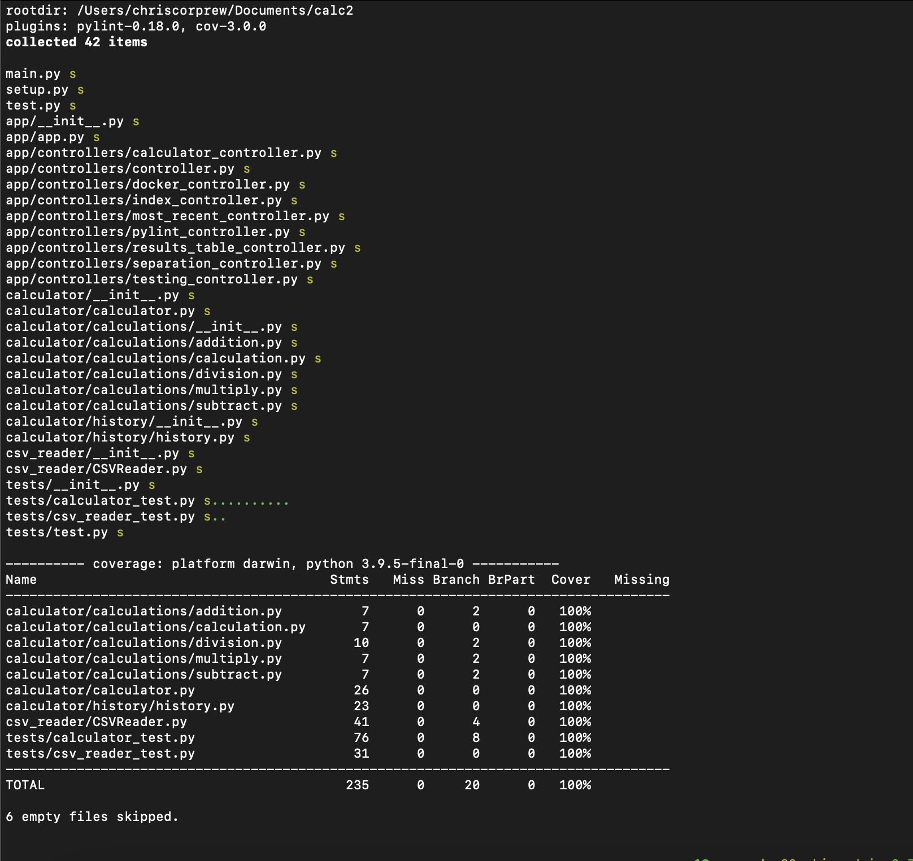

# Calculator Project
+ Ran out of credits so using build status picture

# Application Tutorial Video

If tutorial doesn't work, it is in the readme_images folder and it is call calc-vid-tut.mp4.

# Note
+ If it doesn't work at first on Docker, you may have to `pip install -r requirements` inside of a terminal inside of flask on Pycharm, delete all past images, build it again, and then it should work.

# Build Status

